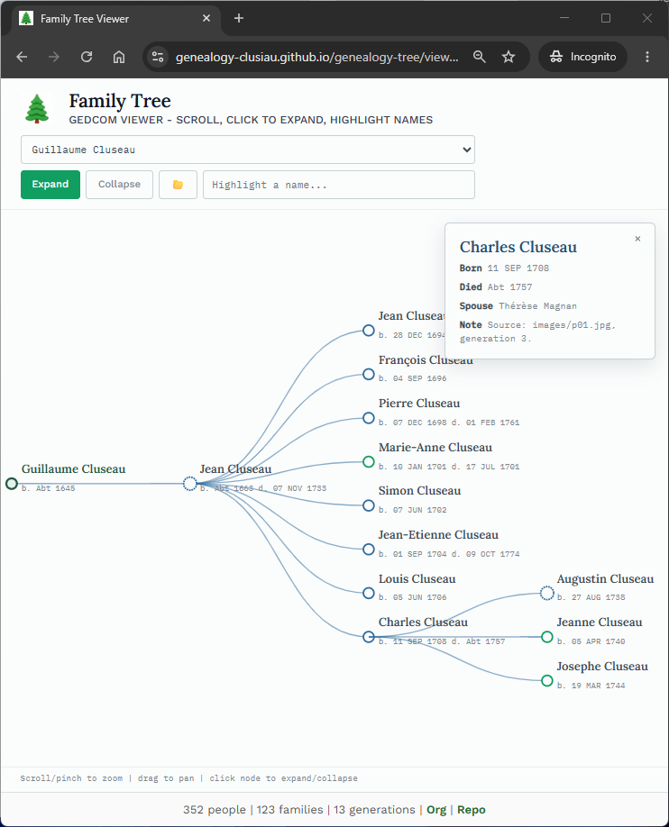
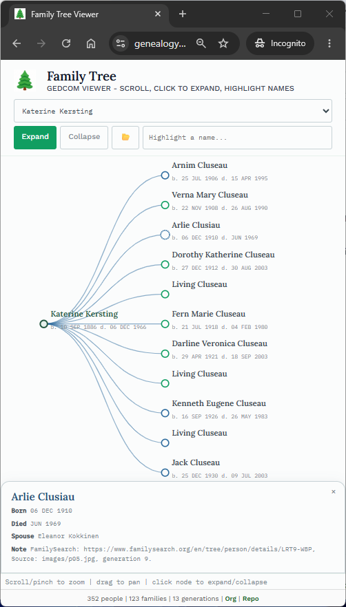

# Clusiau (Cluseau) Genealogy Builder

> Private builder repository for the Clusiau / Cluseau family genealogy archive.

## Where to start

- **Browse the public tree:**
  View the redacted public tree at
  <https://genealogy-clusiau.github.io/genealogy-tree/>

- **Builder documentation:**
  View the builder docs at
  <https://genealogy-clusiau.github.io/genealogy-tree/>

- **GEDCOM source data:**
  See the redacted GEDCOM files in `ged/`.
  Do not publish raw GEDCOM files directly
  unless they have been reviewed for
  living/private individuals.

## How to add or correct information

1. Open an issue describing the correction, or
2. Edit `data.ged` directly and open a pull request, or
3. If you're not comfortable with GitHub,
   contact **[Denise Case]** and
   they'll make the edit for you.

Please cite a source for any correction (a document, a person's
recollection with their name/date, etc.) so we can track provenance -
genealogy accuracy depends on it.

## Examples

## Project Documentation

Additional documentation:

[docs/index.md](docs/index.md)

## Citation

[CITATION.cff](./CITATION.cff)

## License

[MIT](./LICENSE)
